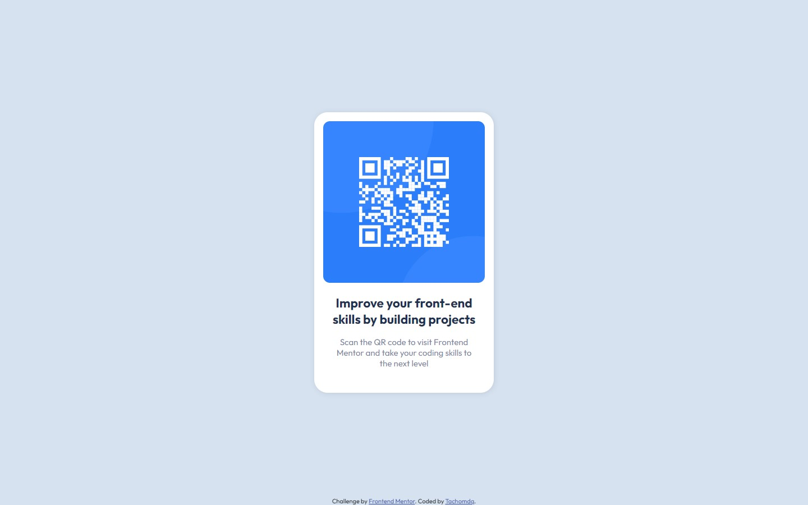

# Frontend Mentor - QR code component solution

This is a solution to the [QR code component challenge on Frontend Mentor](https://www.frontendmentor.io/challenges/qr-code-component-iux_sIO_H). Frontend Mentor challenges help you improve your coding skills by building realistic projects.

## Table of contents

- [Overview](#overview)
  - [Screenshot](#screenshot)
  - [Links](#links)
- [My process](#my-process)
  - [Built with](#built-with)
  - [What I learned](#what-i-learned)
  - [Continued development](#continued-development)
  - [Useful resources](#useful-resources)
- [Author](#author)

## Overview

### Screenshot

- Taken at 1440*900

### Links

- Solution URL: [GitHub repository](https://github.com/Tachomdq/tachomdq.github.io)
- Live Site URL: [GitHub Pages](https://tachomdq.github.io/)

## My process

### Built with

- Semantic HTML5 markup
- CSS custom properties
- Flexbox
- Mobile-first workflow

### What I learned

- In this project I was able to improve my handling of CSS, such as the understanding of the box-model, the use of flexbox, how to import fonts directly to the css file. I also reinforced knowledge of box positioning and responsible units of measurement.

- Much knowledge gained about Git and Github.

### Continued development

- I must continue to reinforce all the knowledge used in this project and learn new ways to improve my code.

### Useful resources

- [W3Schools](https://www.w3schools.com/) - This helped me throughout the learning.
- [deivchoi](https://www.youtube.com/watch?v=8-RC-Q7Wtzc&t=1680s&ab_channel=deivchoi) - This video laid the foundations of most of my knowledge to be able to face this project.

## Author

- Website - [Luciano Javier Tacchini](https://github.com/Tachomdq)
- Frontend Mentor - [@Tachomdq](https://www.frontendmentor.io/profile/Tachomdq)